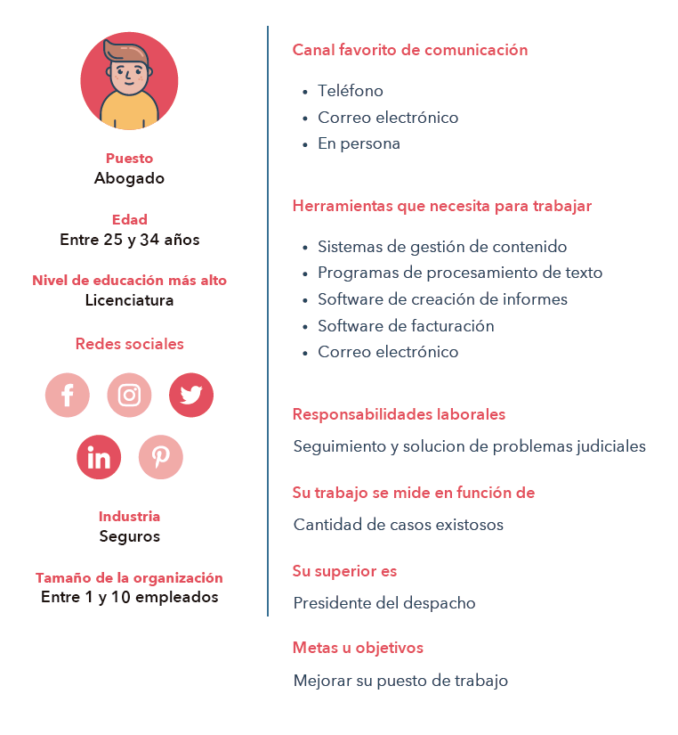

# LaunchX_Abogabot_FrontEnd
Práctica de Wireframe para el curso FrontEnd de LaunchX Microsoft

# Abogabot

**Descripción.**
Se requiere una página web que sea responsive para poder interactuar desde el smartphone en la cual un despacho de abogados podrá automatizar las demandas de sus clientes mediante un formulario. Al ser llenado el formulario por el cliente se manda al proceso de pago y el cliente es capaz de dar seguimiento a su demanda al crear una cuenta en la página. Por otro lado, el administrador recibe las notificaciones de nuevas demandas y con los datos llenados del formulario del cliente se crea de forma automática el documento legal en formato Word para empezar el proceso. El administrador, además de poder ver el pago efectuado por el cliente en un dashboard, actualiza el proceso de la demanda y agrega comentarios. La preferencia de colores es azul marino y blanco.
https://github.com/ElPoder1

**1. Toma de requerimentos.**
Considerando que la aplicación debe de ser responsiva para celular y que la preferencia de colores es azul marino y blanco, se tienen 2 líneas principales de requerimientos a tomar en cuenta:
***UX de Cliente***
•	Creación de cuenta del cliente
•	Formulario de captura de datos de la demanda
•	Método de pago o transacción
•	Numero de seguimiento del caso
•	Notificación de actualización del caso
•	Observación de comentarios del abogado

***UX de Administrador (Abogado).***
•	Creación de cuenta de administrador
•	Notificación de nueva demanda
•	Dashboard con datos y cumplimiento de pago
•	Añadir comentarios y actuaciones del caso al cliente
•	Notificaciones al cliente

## **2. Análisis del flujo de la aplicación.** 
A continuación, se muestra un análisis del flujo de la aplicación según los requerimientos mencionados con anterioridad. Se hizo uso de la herramienta EdrawMax (https://www.edrawsoft.com/edraw-max/).

## **3. Buyer Persona.**
Se hace la definición del cliente ideal, el cual es representado por el abogado administrador. Se hizo uso de la herramienta Hubspot tools (https://www.hubspot.es/make-my-persona).

## **4. Público Objetivo.**
El público objetivo hace referencia a los posibles compradores del servicio y las necesidades de las cuales partir para solucionar sus problemas. Se trata de los clientes de los abogados. Se utilizó la siguiente plantilla: https://miro.com/es/plantillas/publico-objetivo/ 

## **5. UX.**
En base a la toma de requerimientos y el flujo de trabajo de la aplicación, el primer wireframe UX creado es el siguiente. Se utilizó Figma (https://www.figma.com/).

